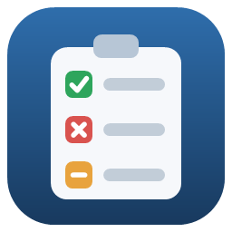
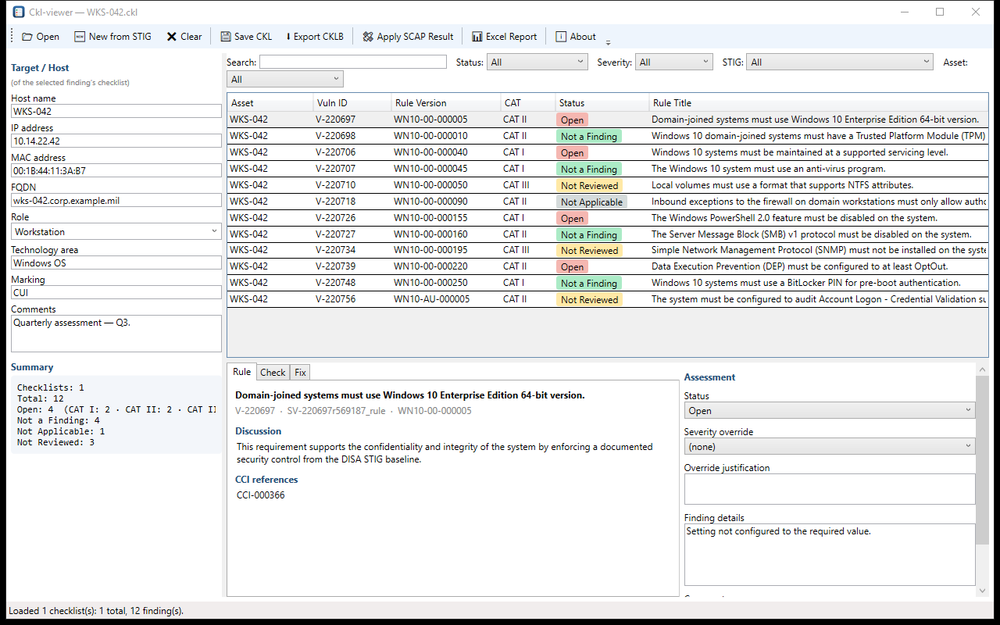
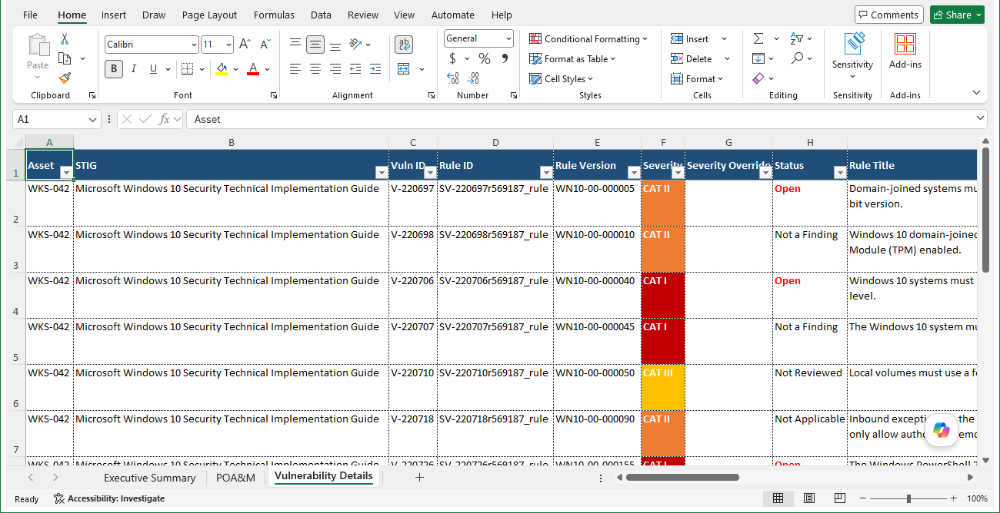
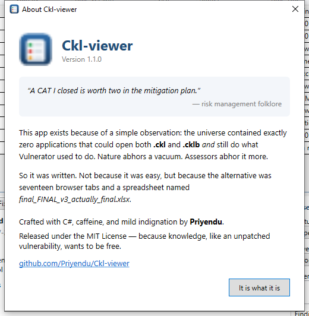

<div align="center">



# Ckl-viewer

**Open, edit, and report on DISA STIG checklists — without the browser-tab circus.**

A free Windows app that opens both `.ckl` and `.cklb` STIG checklists and turns
them into clean Excel reports, the way Vulnerator used to.

### [⬇ Download the latest version](https://github.com/Priyendu/Ckl-viewer/releases/latest)

No account, no install wizard, no cost. Unzip and run.

</div>

---



## Download & run — the easy way

1. Click **[Download the latest version](https://github.com/Priyendu/Ckl-viewer/releases/latest)**.
2. Under **Assets**, grab the **self-contained** zip
   (`CklViewer-…-self-contained.zip`). It works on any Windows 10 or 11 PC with
   nothing else to install.
3. Right-click the downloaded zip → **Extract All**.
4. Double-click **`CklViewer.exe`**. That's it.

> First time you run it, Windows SmartScreen may show a blue "Windows protected
> your PC" box (this happens with any new app that isn't code-signed). Click
> **More info → Run anyway**.

<details>
<summary>Which download do I pick?</summary>

| Download | Size | Best for |
| --- | --- | --- |
| **Self-contained** | ~66 MB | Most people. Runs anywhere, nothing to install. |
| **Framework-dependent** | ~3 MB | You already have (or don't mind installing) the free [.NET 8 Desktop Runtime](https://dotnet.microsoft.com/download/dotnet/8.0). Windows will offer to install it on first run. |

Both are the exact same app — the only difference is whether the .NET runtime is
bundled inside or shared with your PC.

</details>

## What it does

- **Starts a checklist from a STIG** — click **New from STIG** and point it at a
  DISA STIG benchmark (the XCCDF `.xml`, or the `.zip` it downloads in). Every
  rule becomes a Not Reviewed finding, ready to assess — no need to open STIG
  Viewer first.
- **Opens both checklist formats** — `.ckl` (STIG Viewer 2.x) and `.cklb`
  (STIG Viewer 3.x). Just drag your files onto the window, or use the Open
  button. Open several at once and it merges them into one view.
- **Shows findings at a glance** — color-coded statuses (Open, Not a Finding,
  Not Applicable, Not Reviewed) and severity (CAT I / II / III). Search and
  filter by status, severity, STIG, or asset.
- **Status donut chart** — a live pie of the finding statuses across everything
  you've loaded, updating as you assess.
- **Lets you edit** — set a finding's status, type finding details and comments,
  apply a severity override, and update host information. Running totals update
  as you go.
- **Applies your SCAP scan** — drop an XCCDF scan-result file and it updates
  every matching finding automatically.
- **Merges a prior assessment into a new STIG release** — when a manual STIG
  updates, open the new version and **Merge Prior** to carry forward your old
  statuses, finding details, and comments (matched by rule version). New rules
  stay Not Reviewed; rules whose text changed are flagged to re-verify (or reset
  to Not Reviewed — your choice, under ⚙ Settings).
- **Saves back out** — **Save** (Ctrl+S) writes back to the file you opened;
  **Save As…** lets you choose `.ckl` or `.cklb`, ready to open in DISA STIG Viewer.
- **Builds Excel reports in one click** — a polished, Vulnerator-style workbook.



The report has three tabs: an **Executive Summary** (counts and compliance % per
system), a **POA&M** (Plan of Action & Milestones rows for everything still open),
and full **Vulnerability Details** with every rule, ready to filter and share.
Status cells are color-coded to match the donut (toggle it under **⚙ Settings**).

## Using it in three steps

1. **Open** your checklist(s) — drag `.ckl` / `.cklb` files onto the window, or
   click **New from STIG** to start a fresh one from a benchmark.
2. **Review or edit** — click any finding to read the rule, check, and fix text;
   change its status or add notes on the right.
3. **Report** — click **📊 Excel Report** and pick where to save. Done.

<div align="center">

</div>

> **Please note:** like the original web viewer, this tool is for **unclassified
> data only**. Handle checklists containing classified information or CUI on an
> authorized system.

---

## For developers

<details>
<summary>Build from source</summary>

Requires the [.NET 8 SDK](https://dotnet.microsoft.com/download/dotnet/8.0) on Windows.

```powershell
dotnet build CklViewer.slnx
dotnet test CklViewer.slnx
dotnet run --project src/CklViewer
```

### Publishing

**Framework-dependent single file (~10 MB)** — needs the
[.NET 8 Desktop Runtime](https://dotnet.microsoft.com/download/dotnet/8.0) on the
target machine:

```powershell
dotnet publish src/CklViewer -c Release -r win-x64 -p:SelfContained=false -p:PublishSingleFile=true -o publish/fd
```

**Self-contained single file (~71 MB)** — runs with no runtime install:

```powershell
dotnet publish src/CklViewer -c Release -r win-x64 -p:SelfContained=true -p:PublishSingleFile=true -p:EnableCompressionInSingleFile=true -p:IncludeNativeLibrariesForSelfExtract=true -p:DebugType=none -o publish/sc
```

Keep `EnableCompressionInSingleFile` — without it the self-contained exe is
~156 MB. `PublishTrimmed` is not supported for WPF, so ~71 MB is the floor for a
fully standalone build.

Pushing a `v*` git tag runs the [release workflow](.github/workflows/release.yml),
which tests, builds both zips, and publishes a GitHub release automatically.

### Project layout

```
src/CklViewer/
  Models/       Checklist, STIG, and vulnerability domain models
  Parsing/      CKL (XML), CKLB (JSON), and XCCDF result parsers
  Writing/      CKL and CKLB writers
  Reports/      Excel report generator (ClosedXML)
  ViewModels/   WPF MVVM layer
tests/CklViewer.Tests/  Round-trip, SCAP, report, security, and UI tests
```

Built with C# / .NET 8 / WPF. The only third-party dependency is
[ClosedXML](https://github.com/ClosedXML/ClosedXML) for the Excel export.

</details>

## License

[MIT](LICENSE) © Priyendu — free to use, modify, and share.
